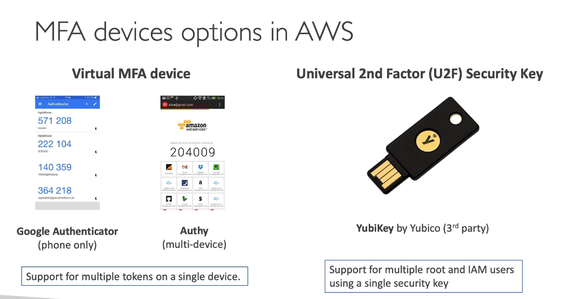

Free Tire [https://aws.amazon.com/free]
What is Cloud Computing :

- cloud Computing is the on-demand delivery of compute power,database storage, application and other it resources
- pay as you go
- provision exactly the right type and size of computing
- access instantly
- simple way to access resources (storage , resources , database)

- ## Cloud Deployment Model

  - ## Private Cloud

    - Cloud Service used by specific organization
    - complete control
    - security for sensitive information
    - meet specific business need
    - Eg : rackspace

  - ## Public Cloud

    - Cloud Resource owned and oprated by third party cloud service provider deliverd over the internet
    - six advantages of cloud

  - ## Hybrid Cloud
    - Keep some servers on premises and extend some capabilities to the cloud
    - control sensitive information secure
    - flexible and cost efficent

- ## Characteristics of Cloud Computing

  1. on-demand self service
  2. Broad network service
  3. multi-tenancy and resource pooling
     - Multiple customer can share the same infrastructure and application with security and privacy
     - Multiple customer are serviced from the same physical resource
  4. Rapid elasticity and scalability
  5. Measured service

- ## Six Advantages of Cloud Computing

  1. Trade capital expance (CAPEX) for operational expance (OPEX)
  2. Benefit from massive economies of scale
  3. Stop guessing capacity
  4. Increase speed and agility
  5. stop spending money running and maintaining data centers
  6. Go to Global in minutes

- ## Problem solved By cloud

  - **flexibility** : chare resource types when need
  - **Cost**- Effectiveness : pay as you go
  - **scalability** : accommodate larger loads by making hardware stronger
  - **Elasticity** : able to scale when need
  - **High-availability** and fault-tolerance : build across data center
  - **Agaility** : rapidly develop , test and lanch software application

- ## Types Of Cloud Computing

  1. Iaas
     - Provide building blocks for cloud IT
     - Easy parallel with traditional on-premises(space) IT
     - Eg : Amazon EC2 (on AWS) , GCP , Azure
  2. PaaS
     - Focus on deployment and management of your application
     - Elastic Beanstalk (on AWS)
     - Heruku , Google App Engine (GCP)
  3. SasS
     - Completed product that is run and managed by service provider
     - Gmail , Dropbox , Zoom

- ## Pricing in AWS Cloud

  - AWS has 3 pricing fundamentals
    1. Compute
       - pay for your compute time
    2. Storage
       - pay for data stored in the cloud
    3. Data Transfer Out of the Cloud
       - pay when data goes out of AWS
       - Data transfer IN is free

- ## AWS Use Case

  - Enterprise It , Backup & storage , Big Data Analytics
  - Website Hosting , Mobile & Social Apps
  - Gaming

- ## AWS Global Infrastructure

  - -> Regions -> Availability Zone -> Data Center
  - AWS Regions

    - 

    - How to Choose Region
    - 

  - AWS Availability Zones
    - Each region has many availability zones
    - 
  - AWS Data Center
    - Each Availability zone has Data Center
    - they are connected with high bandwidth, ultra-low latency networking
  - AWS Edge Locations/ Points of Presence

    - 

  - AWS Globle Scoped Service :

    - Identity and Access Management (IAM)
    - Route 53 (DNS service)
    - CloudFront (Content Delivery Network)
    - WAF (Web Application Firewall)

  - AWS Region scoped Service
    - Amazon EC2 (IaaS)
    - Elastic Beanstalk (Paas)
    - Lambda (Function as a Service)
    - Rekognition (Saas)

- ## Shared Responsibility Modal

  - 
  - 

- ## IAM (Identity and Access Management)

  - global service
  - root account created by default, shouldn't be used or share
  - Users and Groups can be assignd JSON documents called policies
  - 
  - IAM Policy : IAM policy is a JSON file

    - 

    - IAM policy JSON file Structure

      - Version : policy language version , always include "20-05-2023"
      - Id : indentifier for the policy
      - Statement : one or more individual statement **(required)**
      - Statement consists of :

        - Sid : Id of Statement
        - Effect : whether the statement **Allow** or **Deny** acceass
        - Principal : account/user/role to which this policy applied to
        - Actions : list of actions this policy allows or Deny
        - Resource : list of resources where the action is apply
        - Condition : conditions for when this policy is in effect **(optional)**
        - EG : 

      - IAM Roles :
        - Group of Permision = Roles
        - 

    - Multy Password Authentication - MFA

      - users have access to your account and can possibly change configuration or delete resources in you AWS account
      - so you have to Protect Root account
      - MFA = password you know + security device you own
      - 

    - There Are Three Way to access AWS

      - AWS Management Console (Protect by password)
      - AWS command line interface (CLI) (Protect by Access Key)
      - AWS software Development Key (SDK) (Protect By Access key)
      - Access key are generated through the AWS console
      - every user has their own access keys
      - Access key ID ~= username
      - Secrat Access key ~= password
        - 

    - IAM guide-lines

      - 

    - IAM Summary
      - 

- ## Amazon EC2

  - EC2 = Elastic Computer Cloud = IaaS
  - Mainly use for :

    - Renting virtual machine (EC2)
    - storing data in virtual machine (EBC)
    - Distribute load accross machine (EBS)
    - Scaling the services using an auto-scaling group (ASG)

  - EC2 sizing & configuration option

    - OS : linux , windows , & Mac OS
    - How much compute power and cores
    - How much rendom access memory
    - How much storage space:
      - Network-attached(EBS&EFS)
      - hardware (EC2 instance store)
      - Network Card : speed of the card, public Ip address
      - Firewall rules : security group
      - Bootstrap Script : EC2 user Data
    - **Bootstrapping** :

      - lunching commands when machine start
      - that script **runs only ones** at the instance **first start**
      - Used For : - install update - install software - download common file

      - 
      - [https://aws.amazon.com/ec2/instance-types/](AWS Instance Types)

    - **EC2 Instance Type** :

      - **General Puepose (t2)** :
        - Balance Between (t2) :
          - Compute , Memory , Network
      - **Compute Optimized (c6g)** :
        - Reduire High lavel performance processer
      - **Memory Optimized (R6g)** : Fast performance for workloads that process large data sets in memory
      - **Storage Optimized (i3)** : require high Storage-intensive tasks that require high , sequential read and write acess to large data

    - **Security Groups Deeper Dive** :
      - security groups are acting as a firewall on ec2 instances
      - can be attached with multiple instances
      - locked down to a region /VPC combination
      - Does live "outside" the EC2 - if traffic is blocked the EC2 instances won't see it
      - good to maintain one seprate security group for SSH access
      - if your application is not accessible then it;s security group issue
      - if application gives "connection error" then it's an application error or it's not launched
      - All inbound traffic is blocked by default
      - all outbound traffic is authorised by default
      - 

    - **Security Ports to Know for Exam** :
      - 22 = SSH (secure shell) - log into a linux instance
      - 21 = FTP (file transfer protocol) - upload files into a file share
      - 22 = SFTP (secure file transfer protocol) - upload file using ssh 
      - 80 = HTTP - access unsecured website
      - 443 = HTTPS - access secured website
      - 3389 = RDP (Remote Desktop Protocol) - log intp windows instance

  - EC2 Instace Purchashing Oprions 
    - 