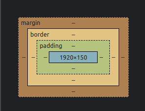
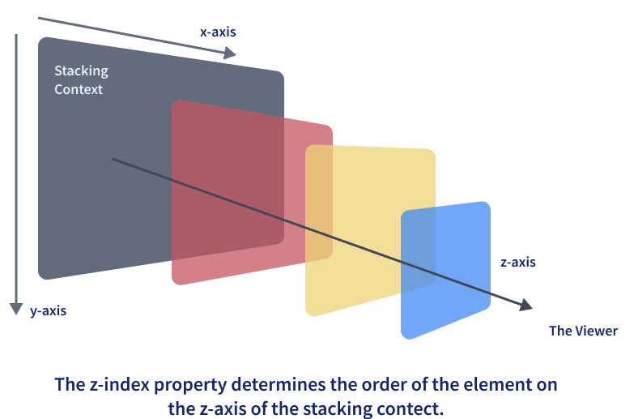

# **
  CSS (cascading style sheets) 
**

 

---

## UseFull Notes

---

 

> justify-content , align-items are only used in parent element
> mix-blend-mode: darken; -> remove background of image

[Prince Makavana](https://princemakavana61.me/)

 

---

## Box Model

---

 

 

---

## Selectors

---

 

- Types of Selectors
  - Universal (\*)
  - Element Type Selector (ul , li , a , b )
  - ID Selector (#)
  - Class Selector (.)
  - Descendent Combinatior (combine two or more selectors)
  - Child Combinatior (>)
  - General Sibling Combinatior (~)
  - Attribute Selector (input [type=”text”])

 

---

## Preprocessor

---

 

- A CSS preprocessor is a program that lets you generate CSS from the preprocessor's own unique syntax.

 

---

## Size Parameters

---

 

- px
- rem
- em
- vh
- vw
- %

 

---

## inline , inline-block , block

---

 

Block : always start with new line
inline : Inline elements don't start on a new line, they appear on the same line as the content and tags beside them.
inline Block : Inline-block elements are similar to inline elements, except they can have padding and margins and set height and width values.

 

---

## Pseudo elements and Pseudo classes

---

 

- Pseudo-elements

  - ::before
  - ::after
  - ::first-letter
  - ::first-line
  - ::selection

- Pseudo-classes
  - :link
  - :visited
  - :hover
  - :active
  - :focus

 

---

## Border Box , Content Box

---

 

- Content Box

  - content-box is the default value box-sizing property. The height and the width properties consist only of the content by excluding the border and padding (content width not collect with padding margin)

  - content width = content width

- Border Box :

  - he box-sizing for the div element is given as border-box. That means the height and width considered for the div content will also include the padding and border. This means that the actual height of the div content will be:

  - content width = content width + padding width + border width

 

---

## Float

---

 

- positioning the HTML elements horizontally either towards the left or right of the container

 

---

## z-index

---

 

- z-index is used for specifying the vertical stacking of the overlapping elements that occur at the time of its positioning. It specifies the vertical stack order of the elements positioned that helps to define how the display of elements should happen in cases of overlapping

 

---

## Flex

---

 

- FlexBox is used for align element efficient way
- flexbox which is largely a 1-dimensional system.
- Properties
  - flex-direaction
  - flex-wrap
  - flex-flow
  - justify-content
  - align-items
  - alogn-content

 

---

## Position Property

---

 

- Absolute : To place an element exactly where you want to place it ,absolute position is actually set relative to the element's parent
- Relative : "Relative to itself". Setting position: relative; on an element and no other positioning attributes, it will no effect on its positioning
- Fixed
- Static
- Sticky

 

---

## Grid System

---

 

- Grid Layout is the most powerful layout system available in CSS. It is said to be a 2-dimensional system, meaning it can handle both columns and rows

 

---

## grid vs flexbox

---

 

- CSS Grid Layout is a two-dimensional system, meaning it can handle both columns and rows. Grid layout is intended for larger-scale layouts which aren’t linear in design.

- Flexbox is largely a one-dimensional system (either in a column or a row). Flexbox layout is most appropriate to the components of an application.

 

---

## :root

---

 
 
-  The :root selector allows you to target the highest-level “parent” element in the DOM, or document tree. It is defined in the CSS Selectors Level 3 specification.
